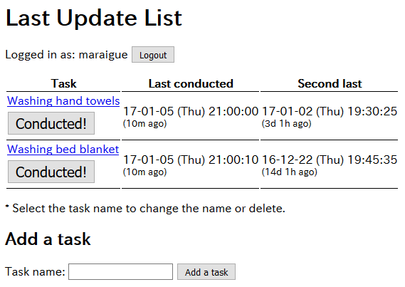

# Last Update List

(C) 2017- H.Hiro <main@hhiro.net> ([Website](http://hhiro.net/ "HHiro.net"), [GitHub](https://github.com/maraigue "maraigue (H.Hiro)"))

Record and display the dates when your tasks are last conducted.

## Screenshot

## Try

http://hhiro.net/lastupdatelist/en/ (user: admin, password: admin)

## Features

- Register your tasks that you want to remember **when you conducted them last**, for example, washing or cleaning something.
- When you conducted the task, press the button "Conducted!".
- The software saves the **last two dates** when you conducted for each task.

## How to run

The software run via web browsers.

This is composed as a [CGI (Common Gateway Interface)](https://en.wikipedia.org/wiki/Common_Gateway_Interface "Common Gateway Interface - Wikipedia") written with [Ruby](http://www.ruby-lang.org/ "Ruby Programming Language").

- One way to run the software is to put the files on a web server that can run Ruby as CGI.
- The other way is to run `server.rb`, a Ruby program with a simple web server "Webrick". By using this, you can run the software on your computer.

### Prerequisites

- [Ruby](http://www.ruby-lang.org/ "Ruby Programming Language")
- [Ruby sqlite3 library](https://rubygems.org/gems/sqlite3/versions/1.3.11 "sqlite3 | RubyGems.org | your community gem host") - usually installed via Rubygems. You will have to install sqlite3 binary and development tools beforehand.

### Preparation

- You may have to change the first line of `lastupdatelist.cgi` (The line `#!/usr/bin/env ruby`) to `#!FullPathNameOfRubyExecutable`.
- You may have to set an appropriate "permission" to `lastupdatelist.cgi` file.
- To change the language, in file `lastupdatelist.cgi`, change the file name `./language.en.cgi` to another.

## LICENSE

The software is released under the MIT License. See `LICENSE` file for the full text.

# Last Update List

(C) 2017- H.Hiro <main@hhiro.net> ([Webサイト](http://hhiro.net/ "HHiro.net"), [GitHub](https://github.com/maraigue "maraigue (H.Hiro)"))

タスクを最後に実施した日を記録/表示する 

## スクリーンショット

※表示言語は日本語にもできます。後述

## 試してみる

http://hhiro.net/lastupdatelist/ja/ (ユーザ名: admin, パスワード: admin)

## 特徴

- **最後に実施した日を覚えておきたい**タスクを登録します。何かを洗濯/掃除したとか。
- タスクを実施したら、「実施した！」ボタンを押します。
- このソフトが、各タスクにつき**直近2回**の実施日を記録しておきます。

## 実行方法

このソフトはWebブラウザを通じて動きます。

このソフトは、[Ruby](http://www.ruby-lang.org/ "Ruby Programming Language")を使った[CGI (Common Gateway Interface)](https://en.wikipedia.org/wiki/Common_Gateway_Interface "Common Gateway Interface - Wikipedia")として作られています。

- 動かす方法の一つは、RubyをCGIで動かせるWebサーバにこのプログラムを置くことです。
- あるいは、`server.rb`を実行することでも動かすことが可能です。これはRubyの簡易Webサーバ「Webrick」を使っており、これがあればそのコンピュータ上で動かすことができます。

### 必要なもの

- [Ruby](http://www.ruby-lang.org/ "Ruby Programming Language")
- [Ruby sqlite3 ライブラリ](https://rubygems.org/gems/sqlite3/versions/1.3.11 "sqlite3 | RubyGems.org | your community gem host") - Rubygemsでインストールするのがよいでしょう。sqlite3のバイナリや開発ツールもインストールする必要があるかもしれません。

### 準備

- `lastupdatelist.cgi`の先頭行（`#!/usr/bin/env ruby`）を、`#!Rubyの実行ファイルのパス含んだ全名称`に変更しないとならないかもしれません。
- `lastupdatelist.cgi`ファイルに適切な「パーミッション」を指定しないとならないかもしれません。
- 表示言語を変更するには、`lastupdatelist.cgi`ファイル中の`./language.en.cgi`というファイル名を変更してください。

## ライセンス

MIT Licenseで提供します。本文（英語）は「LICENSE」ファイルをご覧ください。
